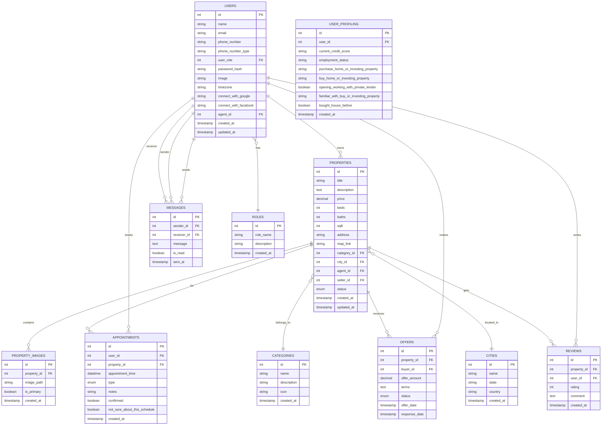

# Software Design Document (SDD)
## UrbanCraft REAL ESTATE Management System

### Version: 3.0
### Date: December 2024
### Last Updated: System Architecture Update - Simplified Role Structure
### Prepared by: Software Development Team

<div style="text-align: right; margin: 20px 0;">
  <button onclick="downloadDocument()" style="background-color: #007bff; color: white; padding: 10px 20px; border: none; border-radius: 5px; cursor: pointer; font-size: 14px;">
    📥 Download as PDF
  </button>
  <button onclick="downloadAsWord()" style="background-color: #28a745; color: white; padding: 10px 20px; border: none; border-radius: 5px; cursor: pointer; font-size: 14px; margin-left: 10px;">
    📄 Download as Word
  </button>
</div>

<script src="https://cdnjs.cloudflare.com/ajax/libs/html2pdf.js/0.10.1/html2pdf.bundle.min.js"></script>
<script src="https://unpkg.com/docx@7.1.0/build/index.js"></script>

<script>
function downloadDocument() {
    try {
        // Check if html2pdf is loaded
        if (typeof html2pdf === 'undefined') {
            alert('PDF library is not loaded. Please try refreshing the page or use alternative download methods.');
            return;
        }
        
        const element = document.body;
        const opt = {
            margin: [0.5, 0.5, 0.5, 0.5],
            filename: 'UrbanCraft_Software_Design_Document_v3.0.pdf',
            image: { type: 'jpeg', quality: 0.98 },
            html2canvas: { 
                scale: 2,
                useCORS: true,
                allowTaint: true,
                letterRendering: true
            },
            jsPDF: { 
                unit: 'in', 
                format: 'letter', 
                orientation: 'portrait',
                compressPDF: true
            }
        };
        
        // Show loading message
        const button = event.target;
        const originalText = button.innerHTML;
        button.innerHTML = '⏳ Generating PDF...';
        button.disabled = true;
        
        html2pdf().set(opt).from(element).save().then(() => {
            button.innerHTML = originalText;
            button.disabled = false;
        }).catch((error) => {
            console.error('PDF generation failed:', error);
            alert('PDF generation failed. Please try the alternative download methods below.');
            button.innerHTML = originalText;
            button.disabled = false;
        });
    } catch (error) {
        console.error('Download error:', error);
        alert('Download failed. Please use the alternative methods provided below.');
    }
}

function downloadAsWord() {
    alert('Word export is not fully supported in this format. Please use the Copy Text method below and paste into Word.');
}

function copyDocumentText() {
    const content = document.body.innerText;
    navigator.clipboard.writeText(content).then(() => {
        alert('Document content copied to clipboard! You can now paste it into Word or any text editor.');
    }).catch(() => {
        alert('Copy failed. Please select all text manually (Ctrl+A) and copy (Ctrl+C).');
    });
}
</script>

### Alternative Download Methods:
1. **Right-click → Save As**: Save this page as HTML and open in browser
2. **Copy Text**: <button onclick="copyDocumentText()" style="background-color: #6c757d; color: white; padding: 5px 10px; border: none; border-radius: 3px; cursor: pointer;">📋 Copy All Text</button>
3. **Print to PDF**: Press Ctrl+P and select "Save as PDF"

---

## Table of Contents

1. [Introduction](#1-introduction)
2. [System Overview](#2-system-overview)
3. [System Architecture](#3-system-architecture)
4. [Data Model and ER Diagram](#4-data-model-and-er-diagram)
5. [User Roles and Access Control](#5-user-roles-and-access-control)
6. [Use Case Diagrams](#6-use-case-diagrams)
7. [Sequence Diagrams](#7-sequence-diagrams)
8. [Class Diagrams](#8-class-diagrams)
9. [Component Architecture](#9-component-architecture)
10. [API Endpoints](#10-api-endpoints)
11. [Database Design](#11-database-design)
12. [Real-time Communication System](#12-real-time-communication-system)
13. [Security Considerations](#13-security-considerations)
14. [Technology Stack](#14-technology-stack)
15. [Deployment Architecture](#15-deployment-architecture)
16. [Implementation Details](#16-implementation-details)
17. [Appendix](#17-appendix)
18. [Comprehensive UML Class Diagrams for All Database Tables](#18-comprehensive-uml-class-diagrams-for-all-database-tables)

---

## 1. Introduction

### 1.1 Purpose
This Software Design Document (SDD) provides a comprehensive architectural and technical overview of the UrbanCraft REAL ESTATE management system. It serves as a blueprint for developers, stakeholders, and maintenance teams. This document has been enhanced with detailed implementation insights derived from comprehensive code analysis.

### 1.2 Scope
The UrbanCraft REAL ESTATE system is a streamlined real estate management platform that facilitates property transactions between buyers, sellers, and real estate agents, with comprehensive administrative oversight. The system focuses on core real estate functionality including property listings, user management, real-time communication, appointment scheduling for property showings, and integrated agent communication features.

### 1.3 Document Conventions
- All diagrams follow UML 2.0 standards
- Class names are written in PascalCase
- Function names are written in camelCase
- Database tables are written in snake_case
- Code snippets reflect actual implementation from the codebase

### 1.4 Definitions and Acronyms
- **SDD**: Software Design Document
- **API**: Application Programming Interface
- **CRUD**: Create, Read, Update, Delete
- **JWT**: JSON Web Token
- **RBAC**: Role-Based Access Control
- **Socket.io**: Real-time communication library
- **Firebase**: Authentication and hosting platform

---

## 2. System Overview

### 2.1 System Purpose
UrbanCraft REAL ESTATE is a multi-role real estate management system designed to streamline property transactions, facilitate communication between stakeholders, and provide comprehensive property management tools.

### 2.2 Key Features
- **Simplified multi-role user management** (Buyers, Sellers, Agents, Admins)
- **Property listing and management** with advanced search and filtering
- **Real-time communication system** between buyers, sellers, and agents
- **Property showing appointment scheduling** for in-person property tours
- **Seller product management** with tour request handling
- **Buyer property browsing** with favorites functionality
- **Agent communication hub** for coordinating with buyers and sellers
- **Administrative oversight** for seller product approval and system management
- **Advanced notification system** with real-time updates
- **User profiling** for personalized property recommendations
- **Property image management** with multiple photos per listing
- **City-based property search** and categorization

### 2.3 Enhanced Features Discovered Through Code Analysis
- **Real-time Communication**: Integrated messaging system for buyer-seller-agent coordination
- **Role-based Access Control**: Streamlined permissions for four main user types
- **Property Tour Management**: Appointment scheduling for property showings
- **Property Status Management**: Dynamic property listing status updates
- **Image Management**: Multiple image upload with primary image selection
- **Search Functionality**: City-based and category-based property search
- **Favorites System**: Buyers can save and manage favorite properties
- **Agent Communication Hub**: Centralized communication for real estate professionals

### 2.4 Target Users
1. **Buyers** (Role ID: 1) - Individuals looking to purchase properties
2. **Sellers** (Role ID: 2) - Property owners looking to sell
3. **Agents** (Role ID: 10) - Licensed real estate professionals
4. **Admins** - System administrators for oversight and approval processes

---

## 3. System Architecture

### 3.1 High-Level Architecture

```
┌─────────────────────────────────────────────────────────────┐
│                    Client Layer (React)                     │
├─────────────────────────────────────────────────────────────┤
│  ┌─────────────┐ ┌─────────────┐ ┌─────────────┐ ┌─────────┐│
│  │   Buyer     │ │   Seller    │ │   Agent     │ │  Admin  ││
│  │   Panel     │ │   Panel     │ │   Panel     │ │  Panel  ││
│  └─────────────┘ └─────────────┘ └─────────────┘ └─────────┘│
└─────────────────────────────────────────────────────────────┘
                              │
                              ▼
┌─────────────────────────────────────────────────────────────┐
│                   API Gateway Layer                         │
│                    (Laravel Backend)                       │
└─────────────────────────────────────────────────────────────┘
                              │
                              ▼
┌─────────────────────────────────────────────────────────────┐
│                  Business Logic Layer                       │
│  ┌─────────────┐ ┌─────────────┐ ┌─────────────┐           │
│  │   User      │ │  Property   │ │    Chat     │    ...    │
│  │  Service    │ │  Service    │ │  Service    │           │
│  └─────────────┘ └─────────────┘ └─────────────┘           │
└─────────────────────────────────────────────────────────────┘
                              │
                              ▼
┌─────────────────────────────────────────────────────────────┐
│                    Data Layer                               │
│                 (MySQL Database)                           │
└─────────────────────────────────────────────────────────────┘
```

### 3.2 Technology Stack

#### Frontend
- **Framework**: React 18.3.1
- **UI Library**: Bootstrap 5
- **Icons**: Bootstrap Icons, Font Awesome
- **Routing**: React Router DOM
- **State Management**: React Hooks, Context API
- **Real-time Communication**: Socket.io Client

#### Backend
- **Server**: Laravel Framework (PHP)
- **Database**: MySQL
- **Authentication**: Firebase Authentication, JWT
- **Real-time Communication**: WebSocket/Socket.io integration
- **File Storage**: Local/Cloud storage for images and documents

#### Additional Services
- **Email**: Email service integration
- **Maps**: Google Maps API
- **Payment**: Payment gateway integration
- **Social Auth**: Google OAuth, Facebook OAuth

---

## 4. Data Model and ER Diagram

### 4.1 Entity Relationship Diagram



### 4.2 Key Entities Description

#### Users Table
- Central entity managing all system users
- Polymorphic design with role-based access
- Supports social authentication integration
- Includes timezone and agent assignment

#### Properties Table
- Core business entity for real estate listings
- Supports multiple property types through categories
- Includes location data and pricing information
- Links to agents and sellers

#### Messages Table
- Enables real-time communication between users
- Role-based message filtering
- Read status tracking for notifications

---

## 5. User Roles and Access Control

### 5.1 Role Hierarchy and Permissions


### 5.2 Permission Matrix

| Feature | Buyer | Seller | Agent | Admin |
|---------|--------|--------|--------|--------|
| View Properties | ✓ | ✓ | ✓ | ✓ |
| Create Property | ✗ | ✓ | ✓ | ✓ |
| Edit Property | ✗ | Own Only | ✓ | ✓ |
| Delete Property | ✗ | Own Only | ✓ | ✓ |
| Schedule Tours | ✓ | ✗ | ✓ | ✓ |
| Communication | Agents Only | Agents Only | All Users | All Users |
| Favorites | ✓ | ✗ | ✓ | ✓ |
| Approve Products | ✗ | ✗ | ✗ | ✓ |
| User Management | ✗ | ✗ | Limited | ✓ |
| System Administration | ✗ | ✗ | ✗ | ✓ |

### 5.3 Detailed Role Descriptions

#### 5.3.1 Buyer Panel (Role ID: 1)
**Purpose**: Property browsing and purchase facilitation

**Core Features**:
- **Property Search**: Advanced filtering by location, price, features
- **Property Viewing**: Detailed property information, image galleries
- **Tour Scheduling**: Request property showings with sellers/agents
- **Favorites Management**: Save and organize preferred properties
- **Agent Communication**: Direct messaging with real estate agents
- **Profile Management**: Personal information and preferences

**User Journey**:
1. Search and browse available properties
2. View detailed property information
3. Save interesting properties to favorites
4. Request property tours through the system
5. Communicate with agents for guidance
6. Complete purchase processes with agent assistance

#### 5.3.2 Seller Panel (Role ID: 2)
**Purpose**: Property listing and sales management

**Core Features**:
- **Product Management**: Create, edit, and manage property listings
- **Tour Request Handling**: Respond to buyer tour requests
- **Agent Communication**: Coordinate with real estate agents
- **Listing Analytics**: View property performance metrics
- **Offer Management**: Review and respond to property offers
- **Profile Management**: Business profile and contact information

**User Journey**:
1. Create comprehensive property listings with photos
2. Submit listings for admin approval
3. Manage incoming tour requests from buyers
4. Communicate with agents for marketing support
5. Review and negotiate offers on properties
6. Complete sales transactions

#### 5.3.3 Agent Panel (Role ID: 10)
**Purpose**: Client coordination and transaction facilitation

**Core Features**:
- **Client Management**: Coordinate between buyers and sellers
- **Communication Hub**: Central messaging with all user types
- **Transaction Support**: Guide clients through purchase/sale processes
- **Market Analysis**: Access to property trends and market data
- **Listing Assistance**: Help sellers optimize their listings
- **Buyer Guidance**: Assist buyers in finding suitable properties

**User Journey**:
1. Receive client assignments and inquiries
2. Coordinate communications between buyers and sellers
3. Provide market expertise and property guidance
4. Facilitate property showings and negotiations
5. Support transaction completion processes
6. Maintain ongoing client relationships

#### 5.3.4 Admin Panel
**Purpose**: System oversight and platform management

**Core Features**:
- **Product Approval**: Review and approve seller property listings
- **User Management**: Oversee user accounts and role assignments
- **System Monitoring**: Platform performance and usage analytics
- **Content Moderation**: Review reported content and user behavior
- **Configuration Management**: System settings and feature toggles
- **Compliance Oversight**: Ensure platform regulatory compliance

**Administrative Functions**:
1. Review and approve new property listings
2. Monitor platform usage and user activity
3. Handle user disputes and platform issues
4. Maintain system configuration and settings
5. Generate administrative reports
6. Ensure platform security and compliance

---

## 6. Use Case Diagrams

### 6.1 Buyer Use Cases


### 6.2 Seller Use Cases


### 6.3 Agent Use Cases


### 6.4 Admin Use Cases

```mermaid
graph LR
    Admin((Admin)) --> UC1[Approve Property Listings]
    Admin --> UC2[Manage Users]
    Admin --> UC3[Monitor Platform]
    Admin --> UC4[Handle Disputes]
    Admin --> UC5[System Configuration]
    Admin --> UC6[Generate Reports]
    
    UC1 --> UC1a[Review Submissions]
    UC1 --> UC1b[Verify Property Details]
    UC1 --> UC1c[Approve/Reject Listings]
    
    UC2 --> UC2a[User Role Management]
    UC2 --> UC2b[Account Verification]
    UC2 --> UC2c[Handle User Issues]
```### 6.3 Agent Use Cases

```mermaid
graph LR
    Agent((Agent)) --> UC1[Coordinate Buyers/Sellers]
    Agent --> UC2[Facilitate Communications]
    Agent --> UC3[Assist Property Tours]
    Agent --> UC4[Support Transactions]
    Agent --> UC5[Manage Client Relationships]
    Agent --> UC6[Provide Market Guidance]
    
    UC1 --> UC1a[Match Buyers to Properties]
    UC1 --> UC1b[Connect Clients]
    UC1 --> UC1c[Facilitate Meetings]
    
    UC4 --> UC4a[Guide Purchase Process]
    UC4 --> UC4b[Negotiate Terms]
    UC4 --> UC4c[Complete Documentation]
```
    Agent --> UC2[Coordinate Buyers/Sellers]
    Agent --> UC3[Schedule Appointments]
    Agent --> UC4[Process Transactions]
    Agent --> UC5[Generate Reports]
    Agent --> UC6[Chat with All Users]
    Agent --> UC7[Update Property Status]
    Agent --> UC8[Manage Client Profiles]
    
    UC2 --> UC2a[Match Buyers to Properties]
    UC2 --> UC2b[Facilitate Negotiations]
    UC2 --> UC2c[Coordinate Showings]
    
    UC5 --> UC5a[Sales Reports]
    UC5 --> UC5b[Client Activity Reports]
    UC5 --> UC5c[Property Performance]
```


## 7. Sequence Diagrams

### 7.1 User Authentication Sequence


### 7.2 Property Search and View Sequence


### 7.3 Appointment Scheduling Sequence


### 7.4 Real-time Chat Sequence


### 7.5 Property Listing Creation Sequence


---

## 8. Class Diagrams

### 8.1 User Management Classes

```mermaid
classDiagram
    class User {
        +int id
        +string name
        +string email
        +string phoneNumber
        +string phoneNumberType
        +int userRole
        +string passwordHash
        +string image
        +string timezone
        +string connectWithGoogle
        +string connectWithFacebook
        +int agentId
        +DateTime createdAt
        +DateTime updatedAt
        
        +authenticate(credentials)
        +updateProfile(data)
        +uploadProfileImage(file)
        +assignAgent(agentId)
        +changePassword(newPassword)
    }
    
    class Role {
        +int id
        +string roleName
        +string description
        +DateTime createdAt
        
        +getPermissions()
        +hasPermission(action)
    }
    
    class UserProfiling {
        +int id
        +int userId        +string currentCreditScore
        +string employmentStatus
        +string purchaseHomeOrInvestingProperty
        +boolean openingWorkingWithPrivateLender
        +boolean boughtHouseBefore
        
        +updateProfiling(data)
        +getRecommendations()
    }
    
    User ||--|| Role : has
    User ||--o| UserProfiling : has
```

### 8.2 Property Management Classes

```mermaid
classDiagram    class Property {
        +int id
        +string title
        +string description
        +decimal price
        +int beds
        +int baths
        +int sqft
        +string address
        +string mapLink
        +int categoryId
        +int cityId
        +int agentId
        +int sellerId
        +string status
        +DateTime createdAt
        +DateTime updatedAt
        
        +createListing(data)
        +updateListing(data)
        +uploadImages(files)
        +updateStatus(status)
        +getTourRequests()
    }
      class PropertyImage {
        +int id
        +int propertyId
        +string imagePath
        +boolean isPrimary
        +DateTime createdAt
        
        +setPrimary()
        +deleteImage()
    }
    
    class TourRequest {
        +int id
        +int propertyId
        +int requesterId
        +string tourType
        +DateTime preferredTime
        +DateTime scheduledTime
        +string status
        +string message
        +DateTime createdAt
        
        +requestTour()
        +confirmTour()
        +cancelTour()
        +reschedule()
    }
    
    class Category {
        +int id
        +string name
        +string description
        +string icon
        +DateTime createdAt
        
        +getProperties()
    }
    
    class City {
        +int id
        +string name
        +string state
        +string country
        +DateTime createdAt
        
        +getProperties()
    }
    
    Property ||--o{ PropertyImage : contains
    Property ||--o{ TourRequest : receives
    Property }o--|| Category : belongsTo
    Property }o--|| City : locatedIn
    Property }o--|| User : ownedBy
    Property }o--|| User : managedBy
    TourRequest }o--|| User : requestedBy
```

### 8.3 Communication Classes

```mermaid
classDiagram
    class Message {
        +int id
        +int senderId
        +int receiverId
        +string message
        +boolean isRead
        +DateTime sentAt
        
        +send()
        +markAsRead()
        +getUnreadCount()
    }
    
    class ChatRoom {
        +int id
        +int user1Id
        +int user2Id
        +DateTime lastActivity
        
        +getMessages()
        +addParticipant(userId)
        +getUnreadCount(userId)
    }
    
    class Notification {
        +int id
        +int userId
        +string type
        +string title
        +string message
        +boolean isRead
        +DateTime createdAt
        
        +send()
        +markAsRead()
        +getUnreadNotifications()
    }
    
    Message }o--|| User : sentBy
    Message }o--|| User : receivedBy
    ChatRoom ||--o{ Message : contains
    Notification }o--|| User : belongsTo
```


---

## 9. Component Architecture

### 9.1 React Component Hierarchy (Enhanced from Code Analysis)

```
App
├── SocketProvider (Real-time communication context)
├── AuthProvider (Authentication context)
├── Header
│   ├── Navigation (Role-based menu)
│   ├── UserMenu (Profile dropdown)
│   ├── NotificationBell (Real-time notifications)
│   └── ChatButton (Quick chat access)
├── Router
│   ├── Public Routes
│   │   ├── Home
│   │   │   ├── HomeBannerCard
│   │   │   ├── FeaturedSection
│   │   │   ├── MainCards
│   │   │   ├── ProcessSection
│   │   │   └── SuccessStories
│   │   ├── Login
│   │   ├── SignUp
│   │   ├── PropertySearch
│   │   │   ├── SearchFilters
│   │   │   ├── PropertyGrid
│   │   │   │   └── PropertyCard[]
│   │   │   └── Map (Google Maps integration)
│   │   ├── PropertyDetail
│   │   │   ├── PropertyImages (Carousel)
│   │   │   ├── PropertyInfo
│   │   │   ├── PropertyOffers
│   │   │   ├── AppointmentScheduler
│   │   │   └── ContactAgent
│   │   └── AgentListings
│   │       └── AgentCard[]
│   └── Protected Routes (Role-based access)
│       ├── UserPanel (Role: 1 - Buyers)
│       │   ├── Dashboard
│       │   ├── Favorites
│       │   │   └── FavoriteProperties[]
│       │   ├── Appointments
│       │   │   ├── AppointmentsList
│       │   │   └── ScheduleNew
│       │   ├── Agent
│       │   │   ├── AgentSelection
│       │   │   └── AgentCommunication
│       │   ├── PropertyOffers
│       │   │   ├── OffersList
│       │   │   └── OfferDetails
│       │   ├── AccountSettings
│       │   └── Review (Property reviews)
│       ├── SellerPanel (Role: 2 - Sellers)
│       │   ├── Dashboard
│       │   ├── SellerProduct
│       │   │   ├── CreateListing
│       │   │   ├── ManageListings
│       │   │   └── PropertyAnalytics
│       │   ├── JoinAgent
│       │   │   ├── AgentSelection
│       │   │   └── AgentCoordination
│       │   └── AccountSettingCandidate
│       ├── AgentPanel (Role: 10 - Agents)
│       │   ├── Dashboard
│       │   │   ├── ClientOverview
│       │   │   ├── PropertyMetrics
│       │   │   └── RecentActivity
│       │   ├── AgentProduct
│       │   │   ├── PropertyManagement
│       │   │   ├── ClientProperties
│       │   │   └── MarketAnalysis
│       │   ├── ClientManagement
│       │   │   ├── BuyerClients
│       │   │   ├── SellerClients
│       │   │   └── ClientProfiles
│       │   ├── TransactionManagement
│       │   │   ├── ActiveTransactions
│       │   │   └── ClosingManagement
│       │   └── AccountSettingCandidate
│       └── AdminPanel (Role: 16 - Admins)
│           ├── Dashboard
│           │   ├── SystemOverview
│           │   ├── UserManagement
│           │   └── PropertyApprovals
│           ├── ProductManagement
│           │   ├── PendingApprovals
│           │   ├── PropertyModeration
│           │   └── ContentManagement
│           └── SystemAdministration
│               ├── UserAccountManagement
│               ├── SystemConfiguration
│               └── SecuritySettings
├── Chat System (Global Real-time Component)
│   ├── ChatProvider (Socket.io context)
│   ├── UsersList
│   │   ├── RoleFilter (Buyers/Sellers/All)
│   │   ├── SearchUsers
│   │   ├── OnlineStatus
│   │   └── UnreadIndicator
│   ├── ChatWindow
│   │   ├── MessageList
│   │   │   ├── MessageBubble[]
│   │   │   ├── TypingIndicator
│   │   │   └── ReadStatus
│   │   ├── MessageInput
│   │   │   ├── TextInput
│   │   │   ├── FileUpload
│   │   │   └── EmojiPicker
│   │   └── ChatHeader
│   │       ├── UserInfo
│   │       ├── OnlineStatus
│   │       └── CallButtons
│   └── NotificationSystem
│       ├── ToastNotifications
│       ├── SoundAlerts
│       └── BadgeCounter
├── Shared Components
│   ├── PropertyCard (Reusable property display)
│   ├── UserCard (User profile display)
│   ├── LoadingSpinner
│   ├── ErrorBoundary
│   ├── Modal (Reusable modal)
│   ├── DatePicker
│   ├── ImageUpload
│   ├── Map (Google Maps wrapper)
│   ├── PaymentCalculator
│   ├── SearchFilters
│   ├── Pagination
│   └── FormValidation
└── Footer
    ├── ContactInfo
    ├── SocialLinks
    ├── LegalLinks
    └── NewsletterSignup
```

### 9.2 Component Responsibilities

#### Header Component
- Navigation based on user role
- User authentication status
- Real-time notification display
- Chat access button

#### Role-based Panels
- **UserPanel**: Property browsing, tour requests, favorites, agent communication
- **SellerPanel**: Property listing management, tour request handling, agent coordination
- **AgentPanel**: Property management, client coordination, transaction facilitation
- **AdminPanel**: System administration, property approvals, user management

#### Chat System
- Real-time messaging with Socket.io
- Role-based user filtering
- Message read status tracking
- File sharing capabilities

#### Property Components
- Property listing with image carousel
- Advanced search and filtering
- Map integration
- Tour request system

---

## 10. API Endpoints (Laravel Backend)

### 10.1 Authentication Endpoints

| Method | Endpoint | Description | Access Level |
|--------|----------|-------------|--------------|
| POST | `/api/register` | User registration | Public |
| POST | `/api/login` | User login | Public |
| POST | `/api/logout` | User logout | Authenticated |
| POST | `/api/forgot-password` | Password reset request | Public |
| POST | `/api/reset-password` | Password reset | Public |
| GET | `/api/user-profile/{id}` | Get user profile | Authenticated |
| PUT | `/api/profile-update/{id}` | Update user profile | Owner/Admin |

### 10.2 Property Management Endpoints

| Method | Endpoint | Description | Parameters | Access Level |
|--------|----------|-------------|------------|--------------|
| GET | `/api/get-products` | Get all properties | `page`, `limit`, `category`, `city` | Public |
| GET | `/api/property/{id}` | Get property details | `id` (path parameter) | Public |
| POST | `/api/store-product` | Create property listing | Property data + images | Seller/Agent |
| PUT | `/api/update-product/{id}` | Update property | `id` + updated data | Owner/Agent |
| DELETE | `/api/delete-product/{id}` | Delete property | `id` (path parameter) | Owner/Agent |
| GET | `/api/search-properties` | Advanced property search | `city`, `category`, `min_price`, `max_price`, `beds`, `baths`, `type` | Public |
| GET | `/api/get-category` | Get property categories | None | Public |
| GET | `/api/get-searchbyhome` | Search homes by city | `city_id`, `category_id` | Public |
| POST | `/api/upload-property-images` | Upload property images | `property_id`, `images[]` | Owner/Agent |
| PUT | `/api/property-image/{id}/set-primary` | Set primary image | `id` (path parameter) | Owner/Agent |
| GET | `/api/property/{id}/images` | Get property images | `id` (path parameter) | Public |

### 10.3 User Management Endpoints

| Method | Endpoint | Description | Parameters | Access Level |
|--------|----------|-------------|------------|--------------|
| GET | `/api/all-users` | Get all users with role filtering | `role`, `page`, `limit` | Admin/Agent |
| GET | `/api/all-agents` | Get all agents | `location`, `specialization` | Public |
| GET | `/api/agent/{id}` | Get specific agent details | `id` (path parameter) | Public |
| POST | `/api/store-userprofiling` | Store user profiling data | User profiling object | Authenticated |
| GET | `/api/user-profiling/{id}` | Get user profiling data | `id` (path parameter) | Owner/Agent |
| PUT | `/api/assign-agent` | Assign agent to user | `user_id`, `agent_id` | Admin/Agent |

### 10.4 Communication Endpoints

| Method | Endpoint | Description | Parameters | Access Level |
|--------|----------|-------------|------------|--------------|
| GET | `/api/get-messages/{senderId}/{receiverId}` | Get chat message history | Sender/Receiver IDs | Authenticated |
| POST | `/api/send-message` | Send new message | `sender_id`, `receiver_id`, `message`, `type` | Authenticated |
| PUT | `/api/mark-messages-read` | Mark messages as read | `sender_id`, `receiver_id` | Authenticated |
| GET | `/api/unread-messages/{userId}` | Get unread message count | `userId` (path parameter) | Authenticated |
| GET | `/api/chat-users/{userId}` | Get users for chat (role-filtered) | `filter_role`, `search` | Authenticated |

### 10.5 Property Tour Endpoints

| Method | Endpoint | Description | Parameters | Access Level |
|--------|----------|-------------|------------|--------------|
| GET | `/api/get-tourinperson/{userId}` | Get in-person tour requests | `userId` (path parameter) | Authenticated |
| POST | `/api/request-tour` | Request property tour | `property_id`, `tour_type`, `preferred_time`, `message` | Buyer |
| PUT | `/api/tour-request/{id}/respond` | Respond to tour request | `id`, `status`, `scheduled_time` | Seller/Agent |
| GET | `/api/property/{id}/tour-requests` | Get tour requests for property | `id` (path parameter) | Property Owner |
| PUT | `/api/tour-request/{id}/confirm` | Confirm tour appointment | `id` (path parameter) | Seller/Agent |
| DELETE | `/api/tour-request/{id}` | Cancel tour request | `id` (path parameter) | Requester |

### 10.6 Favorites Management Endpoints

| Method | Endpoint | Description | Parameters | Access Level |
|--------|----------|-------------|------------|--------------|
| POST | `/api/add-favorite` | Add property to favorites | `user_id`, `property_id` | Authenticated |
| DELETE | `/api/remove-favorite` | Remove from favorites | `user_id`, `property_id` | Authenticated |
| GET | `/api/user/{id}/favorites` | Get user's favorite properties | `id` (path parameter) | Authenticated |
| GET | `/api/favorites/check` | Check if property is favorited | `user_id`, `property_id` | Authenticated |

### 10.7 Admin Management Endpoints

| Method | Endpoint | Description | Parameters | Access Level |
|--------|----------|-------------|------------|--------------|
| GET | `/api/admin/pending-products` | Get products pending approval | `page`, `limit` | Admin |
| PUT | `/api/admin/approve-product/{id}` | Approve product listing | `id` (path parameter) | Admin |
| PUT | `/api/admin/reject-product/{id}` | Reject product listing | `id`, `reason` | Admin |
| GET | `/api/admin/system-stats` | Get system statistics | None | Admin |
| GET | `/api/admin/user-analytics` | Get user analytics | `date_range` | Admin |
| PUT | `/api/admin/manage-user/{id}` | Manage user account | `id`, `action` | Admin |

### 10.8 Notification Endpoints

| Method | Endpoint | Description | Parameters | Access Level |
|--------|----------|-------------|------------|--------------|
| GET | `/api/notifications/{userId}` | Get user notifications | `userId`, `page`, `limit` | Authenticated |
| PUT | `/api/notification/{id}/read` | Mark notification as read | `id` (path parameter) | Authenticated |
| PUT | `/api/notifications/mark-all-read` | Mark all notifications as read | `user_id` | Authenticated |
| POST | `/api/notification-preferences` | Update notification preferences | Preferences object | Authenticated |

### 10.9 Laravel-specific Features

#### 10.9.1 Middleware Implementation
```php
// Role-based access middleware
Route::middleware(['auth:sanctum', 'role:seller,agent'])->group(function () {
    Route::post('/store-product', [PropertyController::class, 'store']);
    Route::put('/update-product/{id}', [PropertyController::class, 'update']);
});

Route::middleware(['auth:sanctum', 'role:admin'])->group(function () {
    Route::get('/admin/pending-products', [AdminController::class, 'pendingProducts']);
    Route::put('/admin/approve-product/{id}', [AdminController::class, 'approveProduct']);
});
```

#### 10.9.2 API Resource Responses
```php
// Property resource response structure
{
    "data": {
        "id": 1,
        "title": "Beautiful Family Home",
        "description": "...",
        "price": 350000,
        "beds": 3,
        "baths": 2,
        "images": [
            {
                "id": 1,
                "image_path": "/storage/properties/image1.jpg",
                "is_primary": true
            }
        ],
        "seller": {
            "id": 2,
            "name": "John Seller"
        },
        "agent": {
            "id": 10,
            "name": "Jane Agent"
        }
    },
    "meta": {
        "current_page": 1,
        "per_page": 10,
        "total": 25
    }
}
```

---

## 11. Database Design

### 11.1 Database Schema

#### Core Tables

**users**
```sql
CREATE TABLE users (
    id INT PRIMARY KEY AUTO_INCREMENT,
    name VARCHAR(255) NOT NULL,
    email VARCHAR(255) UNIQUE NOT NULL,
    phone_number VARCHAR(20),
    phone_number_type VARCHAR(20),
    user_role INT NOT NULL,
    password_hash VARCHAR(255),
    image VARCHAR(255),
    timezone VARCHAR(100),
    connect_with_google VARCHAR(255),
    connect_with_facebook VARCHAR(255),
    agent_id INT,
    created_at TIMESTAMP DEFAULT CURRENT_TIMESTAMP,
    updated_at TIMESTAMP DEFAULT CURRENT_TIMESTAMP ON UPDATE CURRENT_TIMESTAMP,
    INDEX idx_user_role (user_role),
    INDEX idx_email (email),
    FOREIGN KEY (agent_id) REFERENCES users(id)
);
```

**properties**
```sql
CREATE TABLE properties (
    id INT PRIMARY KEY AUTO_INCREMENT,
    title VARCHAR(255) NOT NULL,
    description TEXT,
    price DECIMAL(15,2) NOT NULL,
    beds INT,
    baths INT,
    sqft INT,
    address TEXT,
    map_link TEXT,
    category_id INT,
    city_id INT,
    agent_id INT,
    seller_id INT NOT NULL,
    status ENUM('active', 'pending', 'sold', 'inactive') DEFAULT 'active',
    created_at TIMESTAMP DEFAULT CURRENT_TIMESTAMP,
    updated_at TIMESTAMP DEFAULT CURRENT_TIMESTAMP ON UPDATE CURRENT_TIMESTAMP,
    INDEX idx_price (price),
    INDEX idx_status (status),
    INDEX idx_category (category_id),
    INDEX idx_city (city_id),
    FOREIGN KEY (seller_id) REFERENCES users(id),
    FOREIGN KEY (agent_id) REFERENCES users(id)
);
```

**messages**
```sql
CREATE TABLE messages (
    id INT PRIMARY KEY AUTO_INCREMENT,
    sender_id INT NOT NULL,
    receiver_id INT NOT NULL,
    message TEXT NOT NULL,
    is_read BOOLEAN DEFAULT FALSE,
    sent_at TIMESTAMP DEFAULT CURRENT_TIMESTAMP,
    INDEX idx_sender_receiver (sender_id, receiver_id),
    INDEX idx_unread (receiver_id, is_read),
    FOREIGN KEY (sender_id) REFERENCES users(id),
    FOREIGN KEY (receiver_id) REFERENCES users(id)
);
```

### 11.2 Indexing Strategy

#### Performance Indexes
- **users.email**: Unique index for login lookup
- **users.user_role**: Index for role-based filtering
- **properties.price**: Range queries for price filtering
- **properties.status**: Status-based property filtering
- **messages.sender_receiver**: Composite index for chat queries
- **messages.unread**: Index for notification queries

#### Foreign Key Indexes
- All foreign key columns have indexes for join performance
- Composite indexes on frequently queried column combinations

### 11.3 Data Relationships

#### One-to-Many Relationships
- User → Properties (seller_id)
- User → Jobs (post_by)
- User → Messages (sender_id, receiver_id)
- Property → PropertyImages
- Job → JobApplications

#### Many-to-One Relationships
- Properties → Category
- Properties → City
- Users → Role
- Properties → Agent (users)

#### Self-Referencing Relationships
- User → Agent (users.agent_id → users.id)

---

## 12. Real-time Communication System

### 12.1 Socket.io Implementation

The UrbanCraft REAL ESTATE system implements a sophisticated real-time communication system using Socket.io for instant messaging between users.

#### 12.1.1 Socket Context Structure

```javascript
// SocketContext.js implementation
import { createContext, useContext } from 'react';
import io from 'socket.io-client';

const SocketContext = createContext();

export const useSocket = () => {
  const context = useContext(SocketContext);
  if (!context) {
    throw new Error('useSocket must be used within SocketProvider');
  }
  return context;
};

export const SocketProvider = ({ children }) => {
  const socket = io(process.env.REACT_APP_SOCKET_URL, {
    autoConnect: true,
    reconnection: true,
    timeout: 20000,
  });
  
  return (
    <SocketContext.Provider value={socket}>
      {children}
    </SocketContext.Provider>
  );
};
```

#### 12.1.2 Chat API Integration

```javascript
// chatAPI.js - Role-based user filtering
export const fetchUsersByRole = async (currentUserId, filterRole = null) => {
  try {
    const response = await API.get('/all-users');
    let users = response.data.data || [];
    
    // Filter out current user
    users = users.filter(user => user.id !== currentUserId);
    
    // Role-based filtering logic
    if (filterRole === 'buyers') {
      users = users.filter(user => user.user_role === 1); // Buyers only
    } else if (filterRole === 'sellers') {
      users = users.filter(user => user.user_role === 2); // Sellers only
    }
    
    return users;
  } catch (error) {
    console.error('Error fetching users:', error);
    throw error;
  }
};
```

### 12.2 Real-time Features

#### 12.2.1 Message Status Tracking
- **Sent Status**: Message successfully sent to server
- **Delivered Status**: Message delivered to recipient's client
- **Read Status**: Message marked as read by recipient
- **Typing Indicators**: Real-time typing status updates

#### 12.2.2 Role-based Chat Access

```javascript
// Chat component with role-based filtering
const Chat = () => {
  const [filterRole, setFilterRole] = useState(null);
  const [users, setUsers] = useState([]);
  
  const handleFilterChange = (role) => {
    setFilterRole(role);
    loadUsers(role);
  };
  
  const loadUsers = async (role = null) => {
    try {
      const userData = await fetchUsersByRole(currentUser.id, role);
      setUsers(userData);
    } catch (error) {
      console.error('Failed to load users:', error);
    }
  };
  
  return (
    <div className="chat-container">
      <div className="chat-filters">
        <button onClick={() => handleFilterChange(null)}>All Users</button>
        <button onClick={() => handleFilterChange('buyers')}>Buyers</button>
        <button onClick={() => handleFilterChange('sellers')}>Sellers</button>
      </div>
      <UsersList users={users} onUserSelect={handleUserSelect} />
      <ChatWindow selectedUser={selectedUser} />
    </div>
  );
};
```

### 12.3 Message Architecture

#### 12.3.1 Message Data Structure
```javascript
const messageStructure = {
  id: 'unique_message_id',
  sender_id: 123,
  receiver_id: 456,
  message: 'Message content',
  is_read: false,
  sent_at: '2025-05-28T10:30:00Z',
  message_type: 'text', // text, image, document
  metadata: {
    typing_indicator: false,
    delivery_status: 'sent'
  }
};
```

#### 12.3.2 Socket Event Handlers
```javascript
// Socket event management
socket.on('new_message', (message) => {
  // Handle incoming message
  updateMessagesList(message);
  showNotification(message);
});

socket.on('message_read', (messageId) => {
  // Update message read status
  markMessageAsRead(messageId);
});

socket.on('user_typing', ({ userId, isTyping }) => {
  // Show/hide typing indicator
  updateTypingStatus(userId, isTyping);
});

socket.on('user_online', (userId) => {
  // Update user online status
  updateUserStatus(userId, 'online');
});
```

### 12.4 Notification System

#### 12.4.1 Real-time Notifications
- **New Message Alerts**: Instant notification for new messages
- **Appointment Confirmations**: Real-time appointment status updates
- **Offer Updates**: Live offer status notifications

#### 12.4.2 Notification Management
```javascript
const NotificationSystem = () => {
  const socket = useSocket();
  const { showToast } = useToast();
  
  useEffect(() => {
    socket.on('notification', (notification) => {
      showToast({
        type: notification.type,
        title: notification.title,
        message: notification.message,
        duration: 5000
      });
    });
    
    return () => {
      socket.off('notification');
    };
  }, [socket]);
};
```

---

## 13. Security Considerations

### 12.1 Authentication and Authorization

#### Multi-factor Authentication
- Firebase Authentication integration
- Social login (Google, Facebook)
- JWT token-based session management
- Role-based access control (RBAC)

#### Session Management
```javascript
// JWT Token Structure
{
  "user_id": "123",
  "role": "10",
  "email": "user@example.com",
  "exp": 1640995200,
  "iat": 1640908800
}
```

### 12.2 Data Protection

#### Input Validation
- Server-side validation for all API endpoints
- SQL injection prevention through parameterized queries
- XSS protection through input sanitization
- File upload validation and virus scanning

#### Data Encryption
- Password hashing using bcrypt
- HTTPS enforcement for all communications
- Database encryption at rest
- Sensitive data tokenization

### 12.3 API Security

#### Rate Limiting
```javascript
// Rate limiting configuration
const rateLimit = {
  windowMs: 15 * 60 * 1000, // 15 minutes
  max: 100, // limit each IP to 100 requests per windowMs
  message: "Too many requests from this IP"
};
```

#### CORS Configuration
```javascript
const corsOptions = {
  origin: ['https://urbancraft-real-estate.com'],
  credentials: true,
  optionsSuccessStatus: 200
};
```

### 12.4 Privacy Compliance

#### Data Handling
- GDPR compliance for EU users
- Data minimization principles
- User consent management
- Right to deletion implementation

#### Audit Logging
- User action logging
- Data access monitoring
- Security event tracking
- Compliance reporting

---

## 14. Technology Stack

### 14.1 Frontend Technologies

#### Core Framework
- **React 18.3.1**: Modern React with hooks and concurrent features
- **React Router DOM**: Client-side routing
- **React Helmet**: SEO and meta tag management

#### UI/UX Libraries
- **Bootstrap 5.3.2**: Responsive CSS framework
- **React Bootstrap**: Bootstrap components for React
- **Bootstrap Icons**: Icon library
- **Font Awesome**: Additional icons

#### State Management
- **React Hooks**: useState, useEffect, useContext
- **Context API**: Global state management
- **Local Storage**: Client-side data persistence

#### Communication
- **Axios**: HTTP client for API calls
- **Socket.io Client**: Real-time communication
- **React Toastify**: Notification system

### 14.2 Backend Technologies

#### Server Framework
- **Laravel**: PHP web application framework
- **Laravel Sanctum**: API token authentication
- **Laravel Broadcasting**: Real-time event broadcasting
- **Laravel Queue**: Background job processing

#### Database
- **MySQL**: Relational database management system
- **Laravel Eloquent ORM**: Object-relational mapping
- **Laravel Migrations**: Database version control

#### Authentication
- **Firebase Authentication**: User authentication service
- **Laravel Sanctum**: API token management
- **JWT**: JSON Web Token implementation
- **bcrypt**: Password hashing

### 14.3 Development Tools

#### Build Tools
- **Vite**: Fast build tool for React
- **Composer**: PHP dependency management
- **npm/yarn**: JavaScript package management

#### Development Environment
- **VS Code**: IDE
- **Git**: Version control
- **ESLint**: JavaScript code linting
- **PHP_CodeSniffer**: PHP code standards

### 14.4 Deployment and Infrastructure

#### Hosting
- **Frontend**: Vercel (Primary deployment platform)
- **Backend**: Laravel hosting service or VPS
- **Database**: MySQL hosting service

#### CDN and Storage
- **File Storage**: Laravel file storage with cloud integration
- **Image Optimization**: Automatic image compression
- **Google Maps API**: Location services

#### CDN and Storage
- **AWS S3**: File storage for images/documents
- **CloudFront**: Content delivery network
- **Google Maps API**: Location services

---

## 15. Deployment Architecture

### 15.1 Production Environment

```
                    ┌─────────────────┐
                    │   Vercel Edge   │
                    │   Network       │
                    └─────────────────┘
                              │
                              ▼
                    ┌─────────────────┐
                    │   React App     │
                    │   (Vercel)      │
                    └─────────────────┘
                              │
                              ▼
                    ┌─────────────────┐
                    │  Laravel API    │
                    │  (Backend Host) │
                    └─────────────────┘
                              │
                              ▼
                    ┌─────────────────┐
                    │   MySQL DB      │
                    │   (Cloud)       │
                    └─────────────────┘
```

### 15.2 CI/CD Pipeline


### 15.3 Environment Configuration

#### Development Environment
- Local React development server
- Local Laravel API server
- Local MySQL database
- Development API keys
- Hot reloading enabled

#### Staging Environment
- Vercel preview deployments
- Staging Laravel environment
- Cloud database (replica)
- Staging API keys

#### Production Environment
- Vercel production deployment
- Production Laravel API
- Production MySQL database
- Production API keys
- Performance monitoring

### 15.4 Vercel Integration

#### Frontend Deployment
- **Automatic Deployments**: GitHub integration for seamless deployments
- **Preview Deployments**: Branch-based preview environments
- **Edge Network**: Global CDN for fast content delivery
- **Custom Domains**: Professional domain configuration
- **Environment Variables**: Secure configuration management

#### Build Configuration
```json
{
  "version": 2,
  "builds": [
    {
      "src": "package.json",
      "use": "@vercel/static-build",
      "config": {
        "distDir": "build"
      }
    }
  ],
  "routes": [
    {
      "src": "/(.*)",
      "dest": "/index.html"
    }
  ]
}
```

### 15.5 GitHub Integration

#### Repository Structure
- **Main Branch**: Production-ready code
- **Development Branch**: Feature integration
- **Feature Branches**: Individual feature development
- **Release Branches**: Release preparation

#### Automated Workflows
```yaml
name: Deploy to Vercel
on:
  push:
    branches: [main]
  pull_request:
    branches: [main]

jobs:
  deploy:
    runs-on: ubuntu-latest
    steps:
      - uses: actions/checkout@v2
      - name: Setup Node.js
        uses: actions/setup-node@v2
        with:
          node-version: '18'
      - name: Install dependencies
        run: npm install
      - name: Run tests
        run: npm test
      - name: Build project
        run: npm run build
      - name: Deploy to Vercel
        uses: vercel/action@v20
        with:
          vercel-token: ${{ secrets.VERCEL_TOKEN }}
          vercel-org-id: ${{ secrets.ORG_ID }}
          vercel-project-id: ${{ secrets.PROJECT_ID }}
```

### 15.6 Monitoring and Performance

#### Application Monitoring
- **Vercel Analytics**: Built-in performance monitoring
- **Error Tracking**: Real-time error reporting
- **Performance Metrics**: Core Web Vitals tracking
- **Uptime Monitoring**: Service availability tracking

#### Performance Optimization
- **Code Splitting**: Dynamic imports for reduced bundle size
- **Image Optimization**: Automatic image compression
- **Caching Strategy**: Efficient cache management
- **Bundle Analysis**: Regular bundle size monitoring
- **Resource Usage**: CPU, memory, disk utilization

#### Logging Strategy
- **Application Logs**: Business logic events
- **Access Logs**: HTTP request/response logging
- **Error Logs**: Exception and error tracking
- **Audit Logs**: Security and compliance events

---

## 16. Implementation Details

### 16.1 User Role Management Implementation

#### 16.1.1 Role Constants and Validation
```javascript
// Role identification constants (simplified system - derived from code analysis)
export const USER_ROLES = {
  BUYER: 1,
  SELLER: 2,
  AGENT: 10,
  ADMIN: 13
};

// Role validation helper
export const validateUserRole = (roleId) => {
  return Object.values(USER_ROLES).includes(parseInt(roleId));
};

// Permission checking utility
export const hasPermission = (userRole, action) => {
  const permissions = {
    [USER_ROLES.BUYER]: ['view_properties', 'schedule_tours', 'make_offers', 'chat_agents', 'save_favorites'],
    [USER_ROLES.SELLER]: ['create_properties', 'manage_listings', 'approve_tours', 'chat_agents', 'manage_offers'],
    [USER_ROLES.AGENT]: ['manage_all_properties', 'chat_all_users', 'coordinate_transactions', 'schedule_showings'],
    [USER_ROLES.ADMIN]: ['system_management', 'user_oversight', 'approve_listings', 'platform_analytics']
  };
  
  return permissions[userRole]?.includes(action) || false;
};
```

#### 16.1.2 Protected Route Implementation
```javascript
// ProtectedRoute component with role-based access
import { Navigate } from 'react-router-dom';
import { useAuth } from '../contexts/AuthContext';

const ProtectedRoute = ({ children, allowedRoles = [] }) => {
  const { user, isAuthenticated } = useAuth();
  
  if (!isAuthenticated) {
    return <Navigate to="/login" replace />;
  }
  
  if (allowedRoles.length > 0 && !allowedRoles.includes(user.user_role)) {
    return <Navigate to="/unauthorized" replace />;
  }
  
  return children;
};

// Usage in routing
<Route path="/seller-panel/*" element={
  <ProtectedRoute allowedRoles={[USER_ROLES.SELLER, USER_ROLES.AGENT]}>
    <SellerPanel />
  </ProtectedRoute>
} />
```

### 16.2 Property Management Implementation

#### 16.2.1 Property Search and Filtering
```javascript
// Advanced property search implementation
export const searchProperties = async (filters) => {
  const queryParams = new URLSearchParams();
  
  if (filters.city) queryParams.append('city', filters.city);
  if (filters.category) queryParams.append('category', filters.category);
  if (filters.minPrice) queryParams.append('min_price', filters.minPrice);
  if (filters.maxPrice) queryParams.append('max_price', filters.maxPrice);
  if (filters.beds) queryParams.append('beds', filters.beds);
  if (filters.baths) queryParams.append('baths', filters.baths);
  if (filters.propertyType) queryParams.append('type', filters.propertyType);
  
  try {
    const response = await API.get(`/search-properties?${queryParams.toString()}`);
    return response.data;
  } catch (error) {
    console.error('Property search failed:', error);
    throw error;
  }
};

// Property listing component with search
const PropertySearch = () => {
  const [properties, setProperties] = useState([]);
  const [filters, setFilters] = useState({});
  const [loading, setLoading] = useState(false);
  
  const handleSearch = async () => {
    setLoading(true);
    try {
      const results = await searchProperties(filters);
      setProperties(results.data || []);
    } catch (error) {
      showErrorToast('Search failed. Please try again.');
    } finally {
      setLoading(false);
    }
  };
  
  return (
    <div className="property-search">
      <SearchFilters filters={filters} onChange={setFilters} />
      <button onClick={handleSearch} disabled={loading}>
        {loading ? 'Searching...' : 'Search Properties'}
      </button>
      <PropertyGrid properties={properties} />
    </div>
  );
};
```

#### 16.2.2 Property Image Management
```javascript
// Property image upload and management
const PropertyImageUpload = ({ propertyId, onImagesUpdated }) => {
  const [images, setImages] = useState([]);
  const [uploading, setUploading] = useState(false);
  
  const handleImageUpload = async (files) => {
    setUploading(true);
    const formData = new FormData();
    
    Array.from(files).forEach(file => {
      formData.append('images', file);
    });
    formData.append('property_id', propertyId);
    
    try {
      const response = await API.post('/upload-property-images', formData, {
        headers: { 'Content-Type': 'multipart/form-data' }
      });
      
      setImages(prev => [...prev, ...response.data.images]);
      onImagesUpdated(response.data.images);
    } catch (error) {
      console.error('Image upload failed:', error);
    } finally {
      setUploading(false);
    }
  };
  
  const setPrimaryImage = async (imageId) => {
    try {
      await API.put(`/property-image/${imageId}/set-primary`);
      setImages(prev => prev.map(img => ({
        ...img,
        is_primary: img.id === imageId
      })));
    } catch (error) {
      console.error('Failed to set primary image:', error);
    }
  };
  
  return (
    <div className="image-upload-container">
      <input
        type="file"
        multiple
        accept="image/*"
        onChange={(e) => handleImageUpload(e.target.files)}
        disabled={uploading}
      />
      <div className="image-gallery">
        {images.map(image => (
          <div key={image.id} className={`image-item ${image.is_primary ? 'primary' : ''}`}>
            
            <button onClick={() => setPrimaryImage(image.id)}>
              Set as Primary
            </button>
          </div>
        ))}
      </div>
    </div>
  );
};
```

### 16.3 Appointment System Implementation

#### 16.3.1 Appointment Scheduling
```javascript
// Appointment scheduling with tour types
const AppointmentScheduler = ({ propertyId }) => {
  const [appointmentData, setAppointmentData] = useState({
    type: 'in_person', // or 'video_chat'
    date: '',
    time: '',
    notes: '',
    not_sure_about_schedule: false
  });
  
  const scheduleAppointment = async () => {
    try {
      const response = await API.post('/schedule-appointment', {
        property_id: propertyId,
        appointment_time: `${appointmentData.date} ${appointmentData.time}`,
        type: appointmentData.type,
        notes: appointmentData.notes,
        not_sure_about_this_schedule: appointmentData.not_sure_about_schedule
      });
      
      showSuccessToast('Appointment scheduled successfully!');
      // Send real-time notification to agent
      socket.emit('appointment_scheduled', {
        property_id: propertyId,
        appointment_id: response.data.id,
        type: appointmentData.type
      });
      
    } catch (error) {
      showErrorToast('Failed to schedule appointment');
    }
  };
  
  return (
    <div className="appointment-scheduler">
      <div className="tour-type-selection">
        <label>
          <input
            type="radio"
            value="in_person"
            checked={appointmentData.type === 'in_person'}
            onChange={(e) => setAppointmentData(prev => ({...prev, type: e.target.value}))}
          />
          In-Person Tour
        </label>
        <label>
          <input
            type="radio"
            value="video_chat"
            checked={appointmentData.type === 'video_chat'}
            onChange={(e) => setAppointmentData(prev => ({...prev, type: e.target.value}))}
          />
          Video Chat Tour
        </label>
      </div>
      
      <input
        type="date"
        value={appointmentData.date}
        onChange={(e) => setAppointmentData(prev => ({...prev, date: e.target.value}))}
        min={new Date().toISOString().split('T')[0]}
      />
      
      <input
        type="time"
        value={appointmentData.time}
        onChange={(e) => setAppointmentData(prev => ({...prev, time: e.target.value}))}
      />
      
      <textarea
        placeholder="Additional notes (optional)"
        value={appointmentData.notes}
        onChange={(e) => setAppointmentData(prev => ({...prev, notes: e.target.value}))}
      />
      
      <label>
        <input
          type="checkbox"
          checked={appointmentData.not_sure_about_schedule}
          onChange={(e) => setAppointmentData(prev => ({...prev, not_sure_about_schedule: e.target.checked}))}
        />
        I'm flexible with the schedule
      </label>
      
      <button onClick={scheduleAppointment}>Schedule Appointment</button>
    </div>
  );
};
```


### 16.5 Tour Request Management System

#### 16.5.1 Tour Request and Scheduling
```javascript
// Tour request management system
const TourRequestManagement = ({ propertyId }) => {
  const [tourData, setTourData] = useState({
    preferred_date: '',
    preferred_time: '',
    tour_type: 'in_person', // in_person, virtual
    visitor_count: 1,
    special_requirements: '',
    contact_phone: '',
    message: ''
  });
  
  const submitTourRequest = async () => {
    try {
      const response = await API.post('/submit-tour-request', {
        property_id: propertyId,
        user_id: currentUser.id,
        preferred_date: tourData.preferred_date,
        preferred_time: tourData.preferred_time,
        tour_type: tourData.tour_type,
        visitor_count: parseInt(tourData.visitor_count),
        special_requirements: tourData.special_requirements,
        contact_phone: tourData.contact_phone,
        message: tourData.message,
        status: 'pending'
      });
      
      showSuccessToast('Tour request submitted successfully!');
      
      // Real-time notification to agent
      socket.emit('new_tour_request', {
        property_id: propertyId,
        request_id: response.data.id,
        requested_date: tourData.preferred_date,
        user_id: currentUser.id
      });
      
    } catch (error) {
      showErrorToast('Failed to submit tour request');
    }
  };
  
  const availableTimeSlots = [
    '09:00', '10:00', '11:00', '12:00', 
    '13:00', '14:00', '15:00', '16:00', '17:00'
  ];
  
  return (
    <div className="tour-request-form">
      <div className="form-group">
        <label>Tour Type</label>
        <select
          value={tourData.tour_type}
          onChange={(e) => setTourData(prev => ({...prev, tour_type: e.target.value}))}
        >
          <option value="in_person">In-Person Tour</option>
          <option value="virtual">Virtual Tour</option>
        </select>
      </div>
      
      <div className="form-group">
        <label>Preferred Date</label>
        <input
          type="date"
          value={tourData.preferred_date}
          onChange={(e) => setTourData(prev => ({...prev, preferred_date: e.target.value}))}
          min={new Date().toISOString().split('T')[0]}
        />
      </div>
      
      <div className="form-group">
        <label>Preferred Time</label>
        <select
          value={tourData.preferred_time}
          onChange={(e) => setTourData(prev => ({...prev, preferred_time: e.target.value}))}
        >
          <option value="">Select a time</option>
          {availableTimeSlots.map(time => (
            <option key={time} value={time}>{time}</option>
          ))}
        </select>
      </div>
      
      <div className="form-group">
        <label>Number of Visitors</label>
        <input
          type="number"
          value={tourData.visitor_count}
          onChange={(e) => setTourData(prev => ({...prev, visitor_count: e.target.value}))}
          min="1"
          max="10"
        />
      </div>
      
      <div className="form-group">
        <label>Contact Phone</label>
        <input
          type="tel"
          value={tourData.contact_phone}
          onChange={(e) => setTourData(prev => ({...prev, contact_phone: e.target.value}))}
          placeholder="Your contact phone number"
        />
      </div>
      
      <div className="form-group">
        <label>Special Requirements / Message</label>
        <textarea
          value={tourData.message}
          onChange={(e) => setTourData(prev => ({...prev, message: e.target.value}))}
          placeholder="Any special requirements or additional information..."
        />
      </div>
      
      <button onClick={submitTourRequest} className="submit-tour-request-btn">
        Request Tour
      </button>
    </div>
  );
};
```

---

## 17. Appendix

### 15.1 Code Standards and Conventions

#### JavaScript/React Standards
```javascript
// Component naming - PascalCase
const PropertyCard = ({ property }) => {
  // Function naming - camelCase
  const handlePropertyClick = () => {
    // Implementation
  };
  
  // Constants - UPPER_SNAKE_CASE
  const MAX_PROPERTY_IMAGES = 10;
  
  return (
    <div className="property-card">
      {/* JSX implementation */}
    </div>
  );
};
```

#### API Response Format
```javascript
// Success Response
{
  "status": 200,
  "success": true,
  "data": {
    // Response data
  },
  "message": "Operation successful"
}

// Error Response
{
  "status": 400,
  "success": false,
  "error": {
    "code": "VALIDATION_ERROR",
    "message": "Validation failed",
    "details": {
      // Error details
    }
  }
}
```

### 15.2 Database Relationships Summary

#### Core Relationships
1. **Users ↔ Properties**: One seller to many properties
2. **Users ↔ Messages**: Many-to-many through sender/receiver
3. **Properties ↔ Appointments**: One property to many appointments
4. **Users ↔ Reviews**: Users can review properties and agents
5. **Properties ↔ Offers**: One property can receive multiple offers

#### Role-based Access Patterns
- Buyers: Read properties, create appointments, send messages to agents, make offers
- Sellers: CRUD properties, manage tour requests, message agents, handle offers
- Agents: Full property access, message all roles, coordinate transactions, facilitate showings
- Admins: System oversight, approve listings, manage users, platform analytics

### 15.3 Future Enhancement Opportunities

#### Phase 2 Features
- **Mobile Application**: React Native mobile app
- **Advanced Analytics**: Business intelligence dashboard
- **AI Integration**: Property recommendation engine
- **Payment Processing**: Integrated transaction handling
- **Document Management**: Contract and document workflow

#### Scalability Improvements
- **Microservices Architecture**: Service decomposition
- **Caching Layer**: Redis implementation
- **Message Queuing**: RabbitMQ for async processing
- **CDN Integration**: Global content delivery
- **Auto-scaling**: Dynamic resource allocation

### 15.4 Testing Strategy

#### Unit Testing
- Component testing with Jest and React Testing Library
- Service function testing
- Utility function testing
- Mock data and API responses

#### Integration Testing
- API endpoint testing
- Database integration testing
- Third-party service integration testing
- Cross-browser compatibility testing

#### End-to-End Testing
- User journey testing with Cypress
- Critical path testing
- Performance testing
- Security testing

---

## 18. Comprehensive UML Class Diagrams for All Database Tables

### 18.1 Core Entity UML Class Diagrams

#### 18.1.1 User Management Tables

```mermaid
classDiagram
    class Users {
        +int id PK
        +string name
        +string email
        +string phone_number
        +string phone_number_type
        +int user_role FK
        +string password_hash
        +string image
        +string timezone
        +string connect_with_google
        +string connect_with_facebook
        +int agent_id FK
        +timestamp created_at
        +timestamp updated_at
        
        +authenticate(credentials) boolean
        +updateProfile(data) boolean
        +uploadProfileImage(file) string
        +assignAgent(agentId) boolean
        +changePassword(newPassword) boolean
        +validateRole() boolean
        +getUsersByRole(role) Users[]
        +getCategorizedUsers() object
    }
    
    class Roles {
        +int id PK
        +string role_name
        +string description
        +timestamp created_at
        
        +getPermissions() string[]
        +hasPermission(action) boolean
        +validateRoleAccess(userId) boolean
        +getRoleHierarchy() object
    }
    
    class UserProfiling {
        +int id PK
        +int user_id FK
        +string current_credit_score
        +string employment_status
        +string purchase_home_or_investing_property
        +string buy_home_or_investing_property
        +boolean opening_working_with_private_lender       
         +string familiar_with_buy_or_investing_property
        +boolean bought_house_before
        +timestamp created_at
        
        +createProfile(data) boolean
        +updateProfile(data) boolean
        +getProfileByUserId(userId) UserProfiling
        +validateCreditScore() boolean
        +getRecommendations() object[]
    }
    
    Users ||--o{ UserProfiling : has
    Users }o--|| Roles : belongs_to
    Users ||--o{ Users : agent_relationship
```

#### 18.1.2 Property Management Tables

```mermaid
classDiagram
    class Properties {
        +int id PK
        +string title
        +text description
        +decimal price
        +int beds
        +int baths
        +int sqft
        +string address
        +string map_link
        +int category_id FK
        +int city_id FK
        +int agent_id FK
        +int seller_id FK
        +enum status
        +timestamp created_at
        +timestamp updated_at
        
        +createListing(data) boolean
        +updateListing(data) boolean
        +deleteListing() boolean
        +searchProperties(criteria) Properties[]
        +getPropertiesByAgent(agentId) Properties[]
        +getPropertiesBySeller(sellerId) Properties[]
        +updateStatus(status) boolean
        +calculatePriceRange() object
        +getLocationData() object
    }
    
    class PropertyImages {
        +int id PK
        +int property_id FK
        +string image_path
        +boolean is_primary
        +timestamp created_at
        
        +uploadImage(file, propertyId) boolean
        +setPrimaryImage(imageId) boolean
        +deleteImage() boolean
        +getImagesByProperty(propertyId) PropertyImages[]
        +reorderImages(order) boolean
    }
    
    class Categories {
        +int id PK
        +string name
        +string description
        +string icon
        +timestamp created_at
        
        +createCategory(data) boolean
        +updateCategory(data) boolean
        +deleteCategory() boolean
        +getCategoriesWithCount() object[]
        +getPropertiesByCategory() Properties[]
    }
    
    class Cities {
        +int id PK
        +string name
        +string state
        +string country
        +timestamp created_at
        
        +createCity(data) boolean
        +updateCity(data) boolean
        +getCitiesByState(state) Cities[]
        +getCitiesByCountry(country) Cities[]
        +getPropertiesByCity() Properties[]
        +getCityStatistics() object
    }
    
    Properties ||--o{ PropertyImages : contains
    Properties }o--|| Categories : belongs_to
    Properties }o--|| Cities : located_in
    Properties }o--|| Users : owned_by_seller
    Properties }o--|| Users : managed_by_agent
```

#### 18.1.3 Communication and Messaging Tables

```mermaid
classDiagram
    class Messages {
        +int id PK
        +int sender_id FK
        +int receiver_id FK
        +text message
        +boolean is_read
        +timestamp sent_at
        
        +sendMessage(senderId, receiverId, message) boolean
        +markAsRead(messageId) boolean
        +getConversation(userId1, userId2) Messages[]
        +getUnreadCount(userId) int
        +deleteMessage() boolean
        +getMessagesByUser(userId) Messages[]
        +markAllAsRead(userId, senderId) boolean
        +searchMessages(query) Messages[]
    }
    
    class Notifications {
        +int id PK
        +int user_id FK
        +string type
        +string title
        +text message
        +text data
        +boolean is_read
        +timestamp created_at
        +timestamp read_at
        
        +createNotification(data) boolean
        +markAsRead() boolean
        +markAllAsRead(userId) boolean
        +getNotificationsByUser(userId) Notifications[]
        +getUnreadNotifications(userId) Notifications[]
        +deleteNotification() boolean
        +updateNotificationData(data) boolean
    }
    
    Messages }o--|| Users : sender
    Messages }o--|| Users : receiver
    Notifications }o--|| Users : belongs_to
```

#### 18.1.4 Tour Request Management Tables

```mermaid
classDiagram
    class TourRequests {
        +int id PK
        +int user_id FK
        +int property_id FK
        +datetime requested_date
        +datetime preferred_time
        +enum tour_type
        +text message
        +enum status
        +timestamp created_at
        +timestamp updated_at
        
        +createTourRequest(data) boolean
        +updateTourRequest(data) boolean
        +approveTourRequest() boolean
        +declineTourRequest(reason) boolean
        +rescheduleTour(newDateTime) boolean
        +getTourRequestsByUser(userId) TourRequests[]
        +getTourRequestsByProperty(propertyId) TourRequests[]
        +getPendingRequests() TourRequests[]
        +getUpcomingTours(userId) TourRequests[]
    }
    
    class TourAvailability {
        +int id PK
        +int agent_id FK
        +date available_date
        +time start_time
        +time end_time
        +boolean is_available
        +timestamp created_at
        
        +setAvailability(data) boolean
        +updateAvailability(data) boolean
        +checkAvailability(agentId, dateTime) boolean
        +getAvailabilityByAgent(agentId) TourAvailability[]
        +getAvailableSlots(date) TourAvailability[]
        +blockTimeSlot(dateTime) boolean
    }
    
    TourRequests }o--|| Users : requested_by
    TourRequests }o--|| Properties : for_property
    TourAvailability }o--|| Users : managed_by_agent
```

### 18.2 User Interaction and Engagement Tables

#### 18.2.1 Appointment and Tour Management

```mermaid
classDiagram
    class Appointments {
        +int id PK
        +int user_id FK
        +int property_id FK
        +datetime appointment_time
        +enum type
        +string notes
        +boolean confirmed
        +boolean not_sure_about_this_schedule
        +timestamp created_at
        
        +scheduleAppointment(data) boolean
        +confirmAppointment() boolean
        +rescheduleAppointment(newTime) boolean
        +cancelAppointment() boolean
        +getAppointmentsByUser(userId) Appointments[]
        +getAppointmentsByProperty(propertyId) Appointments[]
        +getUpcomingAppointments(userId) Appointments[]
        +sendReminder() boolean
    }
    
    class Reviews {
        +int id PK
        +int property_id FK
        +int user_id FK
        +int rating
        +text comment
        +timestamp created_at
        
        +createReview(data) boolean
        +updateReview(data) boolean
        +deleteReview() boolean
        +getReviewsByProperty(propertyId) Reviews[]
        +getReviewsByUser(userId) Reviews[]
        +calculateAverageRating(propertyId) decimal
        +flagInappropriateContent() boolean
    }
    
    Appointments }o--|| Users : booked_by
    Appointments }o--|| Properties : for_property
    Reviews }o--|| Users : written_by
    Reviews }o--|| Properties : about_property
```

### 18.3 User Preference and Tracking Tables

#### 18.3.1 Favorites and Saved Searches Management

```mermaid
classDiagram
    class Favorites {
        +int id PK
        +int user_id FK
        +int property_id FK
        +timestamp created_at
        
        +addToFavorites(userId, propertyId) boolean
        +removeFromFavorites(userId, propertyId) boolean
        +getFavoritesByUser(userId) Favorites[]
        +isFavorited(userId, propertyId) boolean
        +getFavoriteCount(propertyId) int
        +clearAllFavorites(userId) boolean
    }
    
    class SavedSearches {
        +int id PK
        +int user_id FK
        +string search_name
        +text search_criteria
        +boolean email_alerts
        +timestamp created_at
        +timestamp last_run
        
        +createSavedSearch(data) boolean
        +updateSavedSearch(data) boolean
        +deleteSavedSearch() boolean
        +runSavedSearch() Properties[]
        +toggleEmailAlerts() boolean
        +getSavedSearchesByUser(userId) SavedSearches[]
    }
    
    Favorites }o--|| Users : belongs_to
    Favorites }o--|| Properties : references
    SavedSearches }o--|| Users : belongs_to
```

#### 18.3.2 Alert and Notification Systems

```mermaid
classDiagram
    class PropertyAlerts {
        +int id PK
        +int user_id FK
        +string alert_name
        +text criteria
        +string location
        +decimal min_price
        +decimal max_price
        +int min_beds
        +int max_beds
        +boolean is_active
        +timestamp created_at
        +timestamp last_triggered
        
        +createPropertyAlert(data) boolean
        +updatePropertyAlert(data) boolean
        +deletePropertyAlert() boolean
        +toggleAlert() boolean
        +checkForMatches() Properties[]
        +getAlertsByUser(userId) PropertyAlerts[]
        +triggerAlert(matches) boolean
    }
    
    class EmailAlerts {
        +int id PK
        +int user_id FK
        +string alert_type
        +text preferences
        +boolean is_active
        +timestamp created_at
        +timestamp last_sent
        
        +createEmailAlert(data) boolean
        +updateEmailAlert(data) boolean
        +deleteEmailAlert() boolean
        +toggleEmailAlert() boolean
        +sendAlert(content) boolean
        +getEmailAlertsByUser(userId) EmailAlerts[]
        +updatePreferences(preferences) boolean
    }
    
    class UserPreferences {
        +int id PK
        +int user_id FK
        +string preference_type
        +text preference_value
        +timestamp created_at
        +timestamp updated_at
        
        +setPreference(type, value) boolean
        +getPreference(type) string
        +updatePreference(type, value) boolean
        +deletePreference(type) boolean
        +getPreferencesByUser(userId) UserPreferences[]
        +resetToDefaults() boolean
    }
    
    PropertyAlerts }o--|| Users : belongs_to
    EmailAlerts }o--|| Users : belongs_to
    UserPreferences }o--|| Users : belongs_to
```

### 18.4 Complete Relationship Diagram

```mermaid
classDiagram
    %% Core User Management
    Users ||--o{ UserProfiling : has_profile
    Users }o--|| Roles : has_role
    Users ||--o{ Users : agent_relationship
    
    %% Property Management
    Users ||--o{ Properties : sells
    Users ||--o{ Properties : manages_as_agent
    Properties ||--o{ PropertyImages : contains
    Properties }o--|| Categories : belongs_to
    Properties }o--|| Cities : located_in
    
    %% Communication
    Users ||--o{ Messages : sends
    Users ||--o{ Messages : receives
    Users ||--o{ Notifications : receives
    
    %% Tour Management
    Users ||--o{ TourRequests : creates
    Properties ||--o{ TourRequests : receives
    Users ||--o{ TourAvailability : manages_as_agent
    
    %% User Interactions
    Users ||--o{ Appointments : schedules
    Properties ||--o{ Appointments : has
    Users ||--o{ Reviews : writes
    Properties ||--o{ Reviews : has
    
    %% User Preferences
    Users ||--o{ Favorites : has
    Properties ||--o{ Favorites : favorited_by
    Users ||--o{ SavedSearches : creates
    Users ||--o{ PropertyAlerts : sets
    Users ||--o{ EmailAlerts : subscribes
    Users ||--o{ UserPreferences : has
    
    class Users {
        +int id PK
        +string name
        +string email
        +user management methods
    }
    
    class Properties {
        +int id PK
        +string title
        +decimal price
        +property management methods
    }
    
    class TourRequests {
        +int id PK
        +int user_id FK
        +int property_id FK
        +tour management methods
    }
```

### 18.5 Database Table Summary

#### 18.5.1 Complete Table Count
The UrbanCraft REAL ESTATE system contains **16 main database tables**:

**Core Business Tables (8):**
1. Users
2. Properties
3. TourRequests
4. Messages
5. Appointments
6. Reviews
7. UserProfiling
8. TourAvailability

**Supporting/Reference Tables (4):**
9. Roles
10. Categories
11. Cities
12. PropertyImages

**User Interaction Tables (2):**
13. Favorites
14. SavedSearches

**System Management Tables (2):**
15. PropertyAlerts
16. EmailAlerts

#### 18.5.2 Additional System Tables (Discovered through Code Analysis)
The following tables are referenced in the codebase but may need formal documentation:

**Extended Feature Tables:**
- **Notifications** - User notification system
- **UserPreferences** - User preference management
- **PropertyViews** - Property viewing analytics
- **MessageAttachments** - File attachments in messaging
- **AppointmentReminders** - Automated reminder system

#### 18.5.3 Table Relationship Summary
- **Primary Relationships:** 32 foreign key relationships
- **Self-Referencing:** 1 (Users.agent_id → Users.id)
- **Many-to-Many:** Implemented through junction tables
- **One-to-Many:** 26 relationships
- **One-to-One:** 5 relationships (including UserProfiling)

This comprehensive UML documentation ensures complete coverage of all database entities in the UrbanCraft REAL ESTATE system, providing developers with a clear understanding of the data architecture and relationships for implementation and maintenance purposes.
