# UML 2.0 Diagrams for UrbanCraft Real Estate Management System

## 1. Class Diagrams

### 1.1 User Management Class Diagram

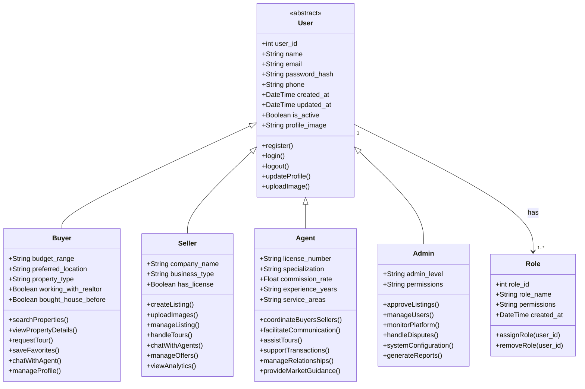

### 1.2 Property Management Class Diagram

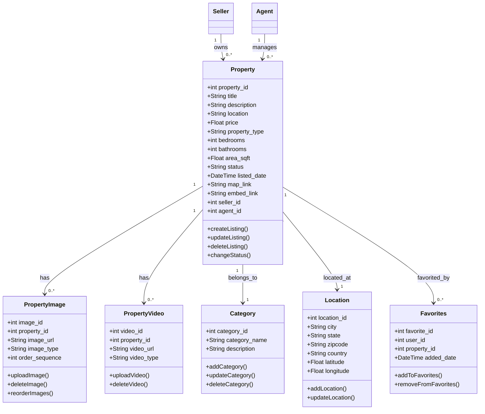

### 1.3 Communication and Transaction Class Diagram

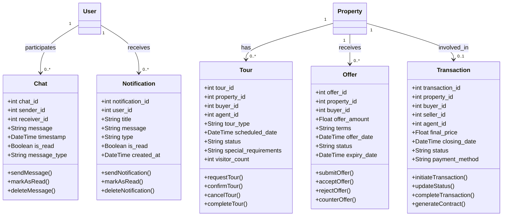

## 2. Sequence Diagrams

### 2.1 User Registration Sequence

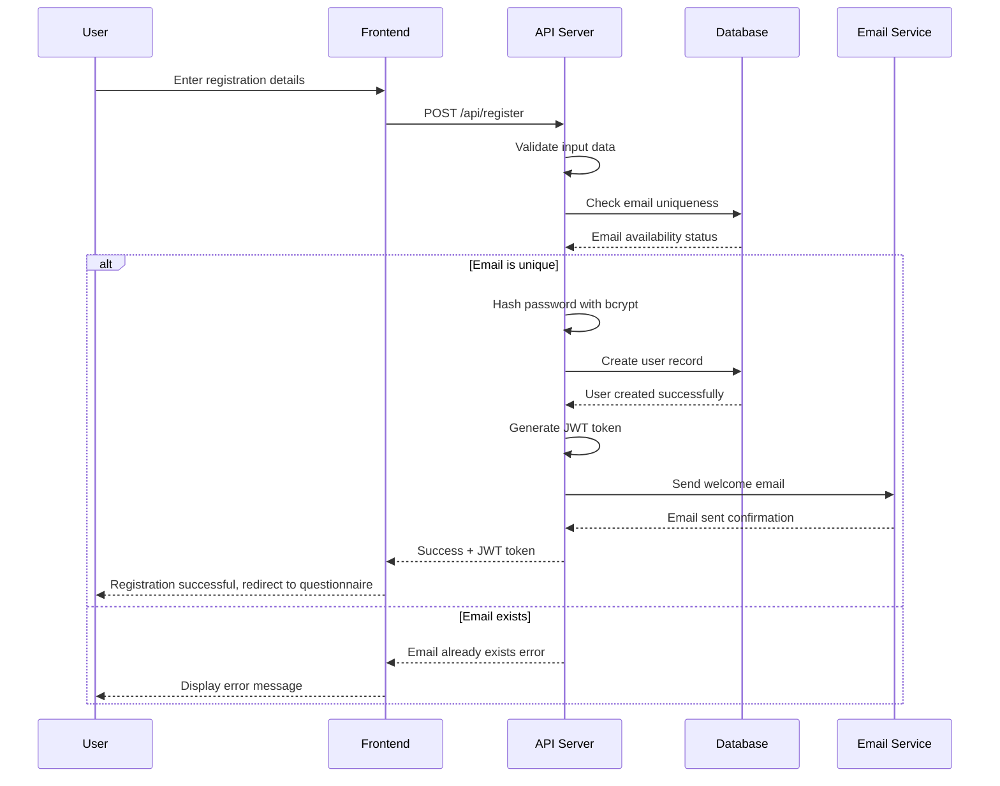

### 2.2 Property Search and View Sequence

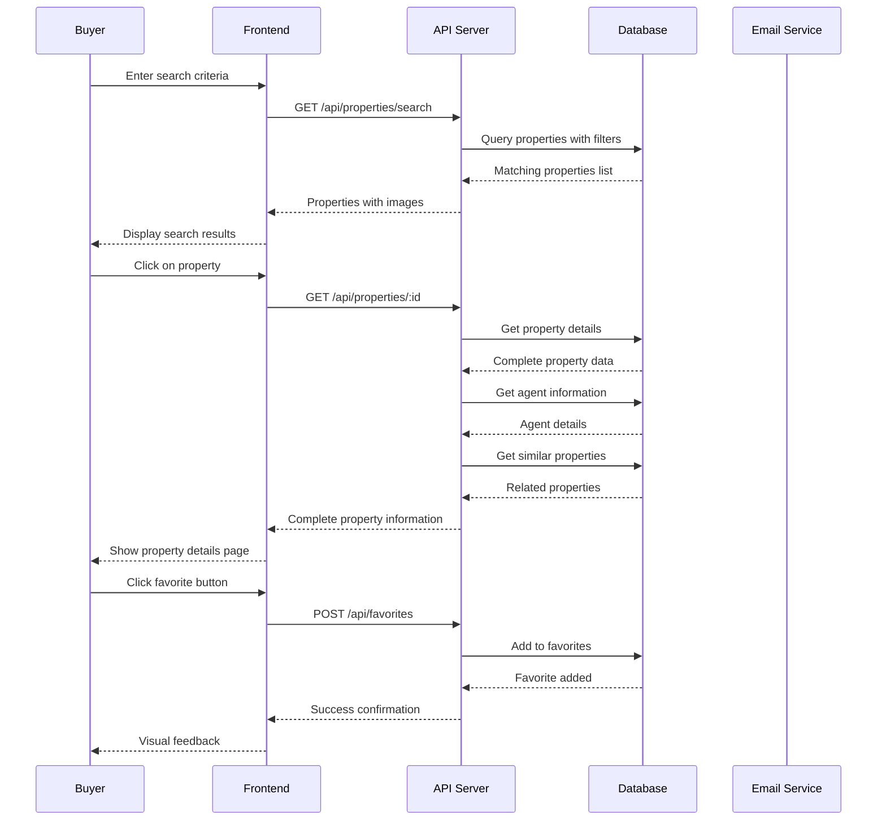

### 2.3 Tour Request and Coordination Sequence

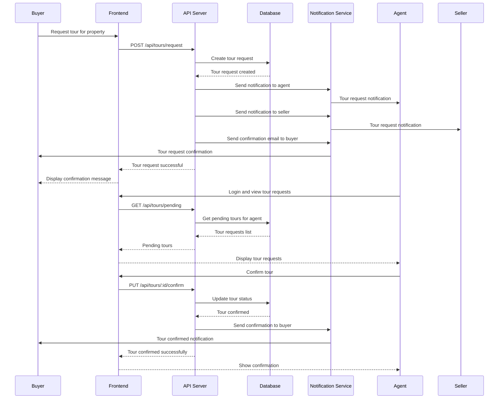

### 2.4 Chat Communication Sequence

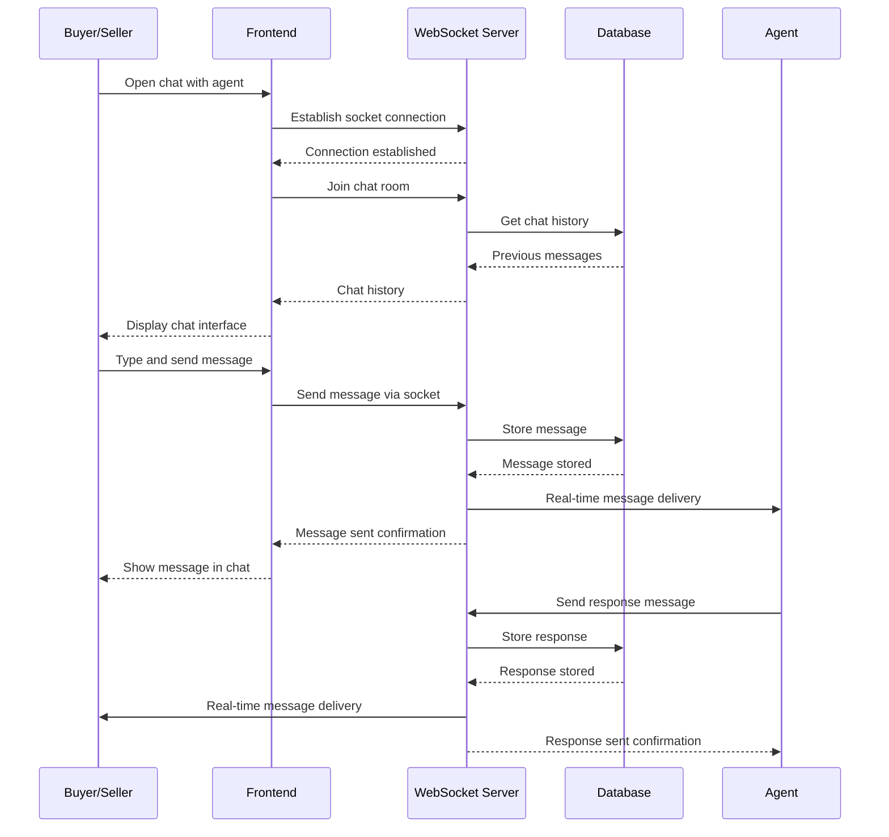

## 3. Activity Diagrams

### 3.1 Property Listing Creation Activity

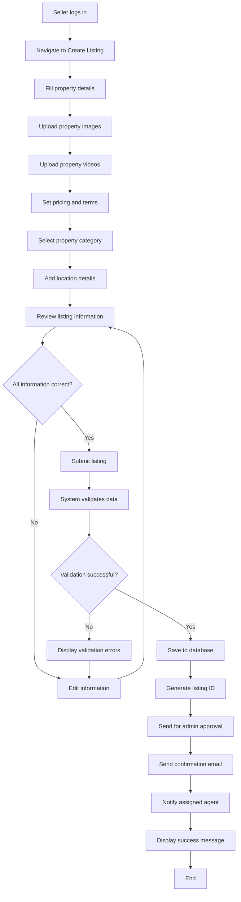

### 3.2 Property Search and Purchase Activity

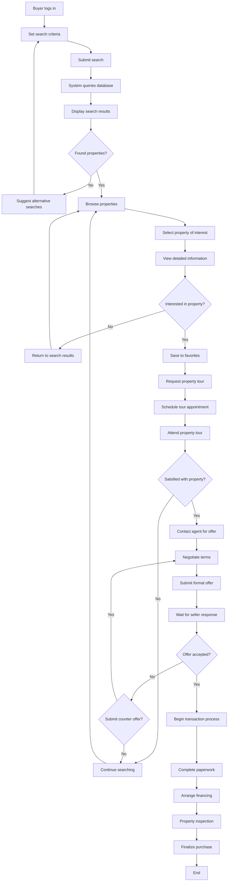

### 3.3 Agent Property Management Activity

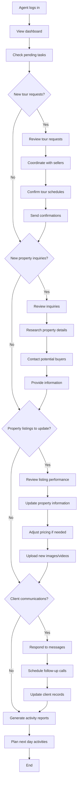

### 3.4 Admin System Management Activity

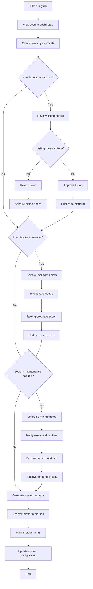

## 4. Use Case Relationships Diagram

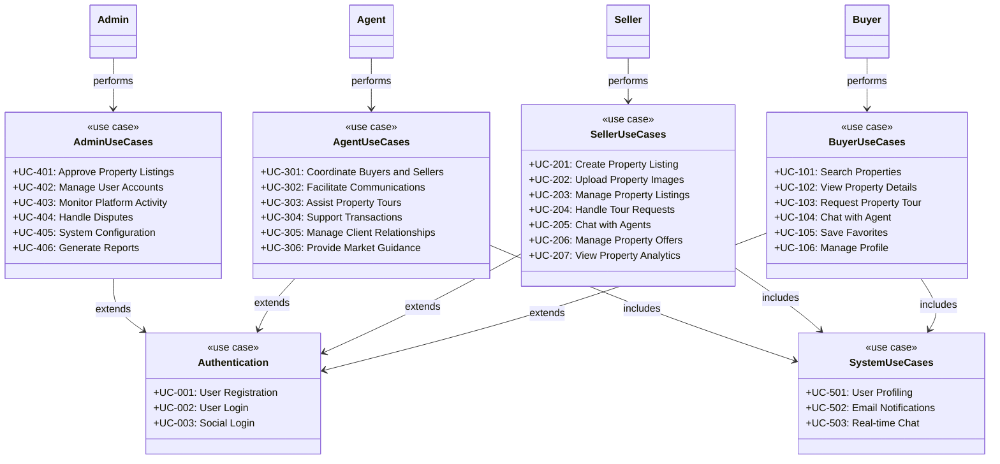
